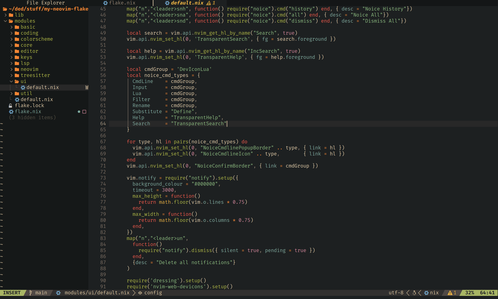
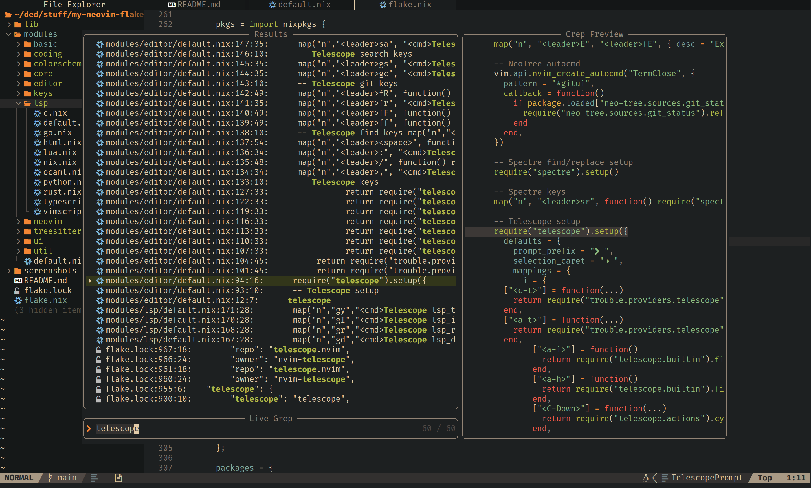
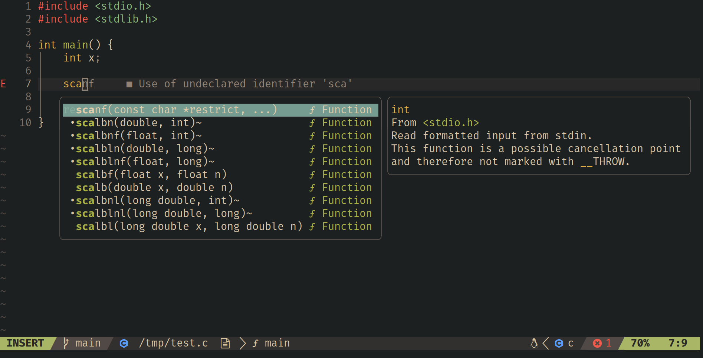

# neovim-flake

My personal neovim config as a flake. This is purposely very unconfigurable and likely to change to fit my own preferences. Recommended way to use this repo is forking it or just taking parts of it as inspiration.

Partially adapted from [cwfryer/neovim-flake](https://github.com/cwfryer/neovim-flake) which is largely based on [LazyVim](https://www.lazyvim.org/).







# Try it out

```sh
nix run github:josephsurin/neovim-flake
```
